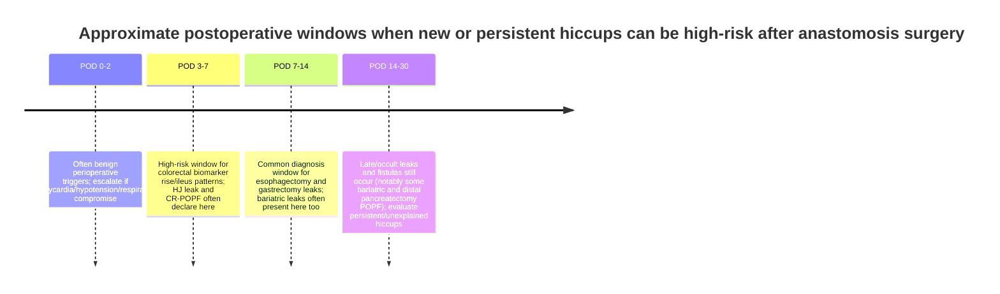

# Postoperative Hiccups After Anastomosis Surgery: When They Signal Anastomotic Leak or Related Life‑Threatening Complications

## Executive summary

Postoperative hiccups (singultus) are usually benign and short‑lived, commonly tied to anesthesia/airway factors, gastric distension, reflux, or transient irritation of the diaphragm and vagal/phrenic pathways.citeturn22view0turn20search2 However, **new, persistent (>48 h), or late‑onset hiccups after an operation involving a gastrointestinal (GI) or hepatopancreatobiliary anastomosis can be an early “referred” symptom of diaphragmatic irritation from subphrenic or intraperitoneal pathology**, including **collections/abscesses that are frequently downstream of an anastomotic leak**.citeturn27view1turn18view0turn19view0turn20search2

The evidence directly linking hiccups to an anastomotic leak is **low‑certainty** (mostly case reports and small series), but the **pathophysiologic plausibility is strong** (phrenic/vagal reflex arc), and the **downstream conditions are high‑risk** (intra‑abdominal infection → sepsis/septic shock).citeturn22view0turn10view11turn15view1 The key clinical point is that **hiccups themselves are not the lethal event—undiagnosed leak/collection and evolving sepsis are**. Sepsis is defined as life‑threatening organ dysfunction due to infection; septic shock is the subset with profound circulatory/metabolic abnormalities (vasopressors to maintain MAP ≥65 mmHg plus lactate >2 mmol/L despite adequate volume).citeturn10view11

Across many anastomosis types, **the highest‑yield “danger window” for new/unexplained hiccups overlaps with the typical leak‑diagnosis window**:
- **Esophagectomy**: diagnosis commonly around **postoperative day (POD) ~7** (ranges extend earlier and later), with many leaks identified in **POD 1–14**.citeturn10view15turn27view0turn11view5  
- **Total gastrectomy / esophagojejunostomy**: median diagnosis around **POD ~7–8** (typical range **POD 2–13/16**).citeturn10view2turn4search9turn27view0  
- **Colorectal**: biomarkers and clinical deterioration often emerge **POD 3–7**, while many leaks are ultimately identified around **POD 7–10** (and sometimes after discharge).citeturn26view1turn8search6turn10view0  
- **Bariatric**: large registry data show average leak presentation roughly **POD ~9–13**, supporting vigilance for **up to ~2 weeks** (and beyond in some classifications).citeturn10view16turn10view3turn10view13  
- **Hepaticojejunostomy (after pancreaticoduodenectomy)**: median diagnosis **POD ~5** (range **POD 1–15**).citeturn10view8  
- **Clinically relevant postoperative pancreatic fistula (CR‑POPF)**: can declare around **POD ~5–6** after pancreaticoduodenectomy, and later after distal pancreatectomy in some cohorts.citeturn25view0turn25view1turn11view7  

**Urgency threshold:** if hiccups occur with **tachycardia, fever, hypotension, tachypnea, confusion, rising CRP/other inflammatory markers**, new ileus or escalating pain, or **suspicious drain output** (feculent/enteric/bilious/high‑amylase), they should be treated as possible **leak‑related sepsis until proven otherwise**, prompting immediate surgical review and expedited imaging/source control.citeturn26view7turn26view1turn10view13turn10view15turn11view3

Point‑of‑care ultrasound (POCUS) can accelerate bedside triage for **free fluid, pneumoperitoneum, pleural effusion, and “complex” (echogenic/septated) collections**, but it **cannot rule out** an anastomotic leak and should generally feed into a pathway culminating in CT (with appropriate contrast strategy) and/or operative/endoscopic evaluation when suspicion remains.citeturn17view2turn15view1turn13view3turn26view1

## Definitions and reference standards

**Hiccups (singultus):** involuntary, intermittent contractions of the diaphragm/intercostal muscles with sudden inspiration and glottic closure (“hic”). Persistent hiccups are typically defined as **lasting >48 hours**, and intractable hiccups as **lasting >1 month**.citeturn22view0turn19view0turn20search2 In general inpatient populations, hiccups are uncommon (reported ~0.05%), but perioperative literature is heavily case‑based.citeturn23view0turn22view0

**Anastomosis:** surgically constructed connection between two luminal structures (e.g., bowel‑bowel, esophagus‑stomach/jejunum, biliary‑enteric, pancreatic‑enteric). A failure of integrity can allow luminal contents to escape into surrounding spaces, creating inflammation/infection.citeturn8search16

**Anastomotic leak (general concept):** breakdown in anastomosis integrity such that luminal contents communicate with extra‑luminal spaces, ranging from radiographic/contained leaks to diffuse peritonitis/septic shock.citeturn8search16turn26view7

**Standardized grading frameworks and organ‑specific leak definitions**
- **Colorectal/rectal anastomotic leak grading (A/B/C)** is commonly referenced via the entity["organization","International Study Group of Rectal Cancer","rectal cancer research group"] proposal: Grade A (no change in management), Grade B (requires active therapy without relaparotomy), Grade C (requires relaparotomy).citeturn11view6  
- Practical colorectal guidance used in many settings comes from the joint entity["organization","Association of Coloproctology of Great Britain and Ireland","uk colorectal surgical society"] and entity["organization","Association of Surgeons of Great Britain and Ireland","uk general surgical society"] document (ACPGBI/ASGBI).citeturn10view0turn26view1  
- **Bile leak (ISGLS):** the entity["organization","International Study Group of Liver Surgery","liver surgery consensus group"] definition: drain bilirubin **≥3× serum bilirubin** on or after **POD 3**, or need for radiologic/operative intervention due to biliary collections or bile peritonitis; graded A/B/C by management impact.citeturn10view9  
- **Postoperative pancreatic fistula (POPF, ISGPS 2016 update):** the entity["organization","International Study Group of Pancreatic Surgery","pancreatic surgery consensus group"] update defines clinically relevant POPF as drain output of any measurable volume with **amylase >3× upper limit of normal** and a clinically relevant condition related to the fistula (biochemical leak replaces “Grade A” in older systems).citeturn11view7turn6search1  
- **Esophagectomy leak consensus:** an international Delphi‑based consensus algorithm was developed with the entity["organization","International Society for Diseases of the Esophagus","esophageal disease society"] guidelines committee, emphasizing standardized diagnosis/treatment pathways for esophagectomy leaks.citeturn11view5  
- **Bariatric registry timing data:** large U.S. registry‑based timing estimates in bariatric surgery come from entity["organization","Metabolic and Bariatric Surgery Accreditation and Quality Improvement Program","bariatric surgery registry"] (MBSAQIP).citeturn10view16  
- **Sepsis definitions:** Sepsis‑3: life‑threatening organ dysfunction caused by dysregulated host response to infection; septic shock subset as defined above.citeturn10view11  
- **Sepsis management principle:** early resuscitation + early source control is emphasized by the entity["organization","Surviving Sepsis Campaign","sepsis guidelines initiative"] guidelines.citeturn11view3turn9search14  

## Mechanisms linking hiccups to anastomosis‑related complications

Hiccups arise from activation of a reflex arc with:
- **Afferent limb:** vagal, phrenic, and sympathetic fibers from thoracoabdominal structures  
- **Central processing:** brainstem pathways  
- **Efferent limb:** primarily the phrenic nerve to the diaphragm, plus intercostal musculature influences.citeturn22view0turn20search21  

Postoperative complications can trigger this arc through several overlapping mechanisms, particularly relevant to anastomosis surgery:

**Diaphragmatic/peritoneal irritation from subphrenic or intraperitoneal collections**
- A leak can produce local inflammation, infected fluid, or abscesses. Subphrenic collections sit adjacent to the diaphragm, facilitating **phrenic nerve irritation** and hiccups.citeturn27view1turn19view0turn18view3  
- A classic gastrectomy series found that **subphrenic abscesses after gastrectomy were frequently leak‑related** (including anastomotic leak and pancreatic fistula).citeturn27view1 This creates a biologically plausible pathway: **leak → subphrenic abscess → persistent hiccups**.

**Pleural/mediastinal spread and thoracoabdominal coupling**
- Upper GI leaks (esophagus, proximal stomach, esophagojejunostomy) can lead to pleural effusions, mediastinal contamination, or transdiaphragmatic inflammation, all of which can stimulate afferent inputs that provoke hiccups.citeturn18view2turn27view0turn13view3

**Luminal distension, ileus, and gastric dysfunction**
- Postoperative ileus or delayed bowel function leads to gastric distension/reflux and vagal stimulation, which is a recognized perioperative hiccup trigger.citeturn22view0turn20search2  
- Importantly, ileus is not only benign; in colorectal surgery, the ACPGBI/ASGBI guidance highlights that postoperative ileus after otherwise uncomplicated laparoscopic colorectal surgery should trigger urgent assessment for anastomotic leakage.citeturn10view0turn26view7  
- This is where “gastric POCUS” (below) can matter: it can document gastric content/volume patterns that correlate with delayed bowel function, potentially acting as an early signal that should prompt vigilance for complications when paired with systemic signs.citeturn10view7turn11view0

**Pneumoperitoneum/free air**
- In the postoperative setting, some free air can be expected, but **pneumoperitoneum combined with systemic deterioration** or abnormal free fluid patterns can indicate perforation or leak. POCUS can detect pneumoperitoneum via signs such as enhanced peritoneal stripe and reverberation artifacts.citeturn17view2turn15view1

## Evidence base linking hiccups to leaks and collections

### What is well supported

**Persistent postoperative hiccups warrant evaluation because they can reflect subphrenic abscess, gastric distension, pneumonia, metabolic disorders, or other pathology.**citeturn20search2turn22view0 While not “leak‑specific,” several of these etiologies are common sequelae of anastomotic failure.

**Upper abdominal surgery series demonstrate that leak‑related complications frequently produce subphrenic abscesses.**
- After gastrectomy for gastric cancer, subphrenic abscess occurred in 4% overall and 8.8% after total gastrectomy; a majority were linked to anastomotic leak (and/or pancreatic fistula).citeturn27view1 This anchors the plausibility that a diaphragm‑irritation symptom (hiccups) can be an early clue to a leak‑driven process.

### Direct clinical observations (case reports and small series)

**Hiccups as early clue to postoperative subdiaphragmatic collection after total gastrectomy**
- A case report described hiccups beginning on **POD 5**, preceding more typical inflammatory signs; CT later showed pleural effusions and a subdiaphragmatic perisplenic collection, with laboratory abnormalities emerging by **POD 7** and eventual improvement on conservative therapy.citeturn18view0turn18view2 Notably, the CT did not demonstrate an obvious anastomotic leak in that case, emphasizing that hiccups may indicate a **related complication (collection/bleeding/infection)** rather than the leak itself.citeturn18view2

**Hiccups as presenting symptom of subphrenic abscess after surgery**
- A postoperative case report described persistent hiccups as the key presenting symptom of a subphrenic abscess after splenectomy, resolving rapidly after drainage—supporting mechanical phrenic irritation as the mechanism.citeturn19view0 (This is not an anastomosis procedure, but the mechanism generalizes directly to leak‑related subphrenic collections.)

**POCUS‑accelerated recognition of postoperative intestinal leak/fistula**
- In a “Gut Point” case report, a patient developed deterioration on **POD 23** after intestinal resection/anastomosis. POCUS identified free intraperitoneal fluid with **floating echogenic material** and pneumoperitoneum; re‑exploration found ischemic bowel involving the prior anastomosis with a puncture opening. The patient progressed to fatal septic complications—illustrating how leak‑associated pathology becomes life‑threatening and how rapid recognition matters.citeturn17view2

### What remains uncertain

There are **no large, high‑quality studies** quantifying:
- the incidence of hiccups specifically among patients with anastomotic leaks (by surgery type), or  
- the predictive value (sensitivity/specificity/likelihood ratios) of “hiccups” as a sign of leak or leak‑related sepsis.

The perioperative hiccup literature remains largely case‑based.citeturn22view0turn23view0 Therefore, clinical decision‑making must rely on **context, timing, associated signs, and low thresholds for imaging/escalation** rather than on a validated “hiccup rule.”

## Leak incidence and typical postoperative timing by surgery type

The table below compiles **representative** incidence ranges and diagnosis timing from guidelines, cohort studies, and large datasets. Because definitions and detection strategies vary, incidence and “time to diagnosis” reflect both biology and surveillance practice.

| Surgery type and typical anastomosis | Leak (or related) incidence (representative) | Typical timing of diagnosis/presentation | Implication for “hiccups danger window” |
|---|---:|---|---|
| Esophagectomy (esophagogastric/esophagoenteric anastomosis) | Often cited ~10–20% in consensus contextciteturn11view5 | Median diagnosis ~POD 7 (range ~2–20) in one cohort; broader range 1–38 with median 7–14 in reviewciteturn10view15turn27view0 | New/persistent hiccups with respiratory signs or sepsis features are highest concern in POD ~3–14 (but not excluded outside it). |
| Total gastrectomy / esophagojejunostomy | EJ leak rates vary; examples include ~5–7% in seriesciteturn20search3turn10view2 | Median diagnosis ~POD 7–8 (range ~2–13/16)citeturn10view2turn4search9turn27view0 | High concern for hiccups emerging around POD ~4–10, especially if evolving pleural effusion, fever, ↑CRP/WBC, or drain changes. |
| Colorectal (colonic/rectal anastomosis) | Reported wide range in reviews (~2–19% depending on context)citeturn8search20 | Biomarker/clinical signals often emerge POD 3–7; many leaks recognized around POD 7–10citeturn26view1turn8search6 | Hiccups are not classic, but **ileus/arrhythmia + other systemic signs** in POD 3–7 should trigger urgent leak assessment; hiccups may reflect distension or subphrenic irritation if collections form.citeturn10view0turn26view7 |
| Bariatric sleeve gastrectomy (staple line leak near GE junction) | MBSAQIP dataset: leak ~0.16% in one analysis; literature often reports higher in other settingsciteturn10view16turn9search9 | Average time to presentation ~POD 13 (± ~8) in MBSAQIP analysis; classic temporal classification includes early/intermediate/late with cut points around POD 1–4 / 5–9 / ≥10citeturn10view16turn10view12 | New/persistent hiccups (esp. with tachycardia/fever) warrants high concern **through at least ~2 weeks**, and longer if late leak syndromes are considered. |
| Roux‑en‑Y gastric bypass (gastrojejunostomy/jejunojejunostomy) | Leak rates vary widely by era and definition (examples: ~2.1% in multicenter data; MBSAQIP ~0.32%)citeturn10view13turn10view16 | Median ~POD 3 (range 0–28) in one large cohort; other cohorts emphasize late leaks 6–20 days and many diagnosed after discharge; MBSAQIP average ~POD 9.5citeturn10view13turn10view3turn10view16 | Maintain high suspicion from **POD ~1 through ~2 weeks** (and up to ~1 month in some series) if systemic signs appear; negative imaging may not exclude.citeturn10view13turn10view3 |
| Hepaticojejunostomy leak (often after pancreaticoduodenectomy) | ~4.8% in a focused PD cohortciteturn10view8 | Median diagnosis POD 5 (range 1–15), typically bilious drain output + fever/leukocytosisciteturn10view8 | Hiccups suggesting subphrenic irritation in **POD ~3–10** should be taken seriously, especially if bilious drainage or rising inflammatory markers accompany. |
| Liver resection bile leak (ISGLS definition) | Example cohort: bile leaks 5.4% overall; graded A/B/C by managementciteturn27view2 | Defined biochemically from POD ≥3; clinically significant leaks often appear with collections needing drainage/stenting/PTBD or laparotomyciteturn10view9turn27view2 | Hiccups may reflect subphrenic collections/biloma/abscess; concern rises from POD ~3 onward if fever/↑CRP/collection suspected. |
| Pancreatic surgery: CR‑POPF after pancreaticoduodenectomy | CR‑POPF rates often in the teens to 20s depending on case mix; POPF is a major complication categoryciteturn11view7turn25view0 | Median fistula “development time” ~POD 5.5 (range 2–12) in one study; definition uses drain amylase criteria and clinical relevanceciteturn25view0turn11view7 | New/persistent hiccups in POD ~3–10 with fever/ileus/sepsis signs should raise suspicion for collections from POPF or anastomotic dehiscence. |
| Distal pancreatectomy: symptomatic POPF | Symptomatic POPF ~22% in one focused cohortciteturn25view1 | Median confirmation POD 9 (range 7–25) in that studyciteturn25view1 | Concern window extends later (second to third postoperative week) for new symptoms including hiccups plus systemic signs. |

## Distinguishing benign postoperative hiccups from leak/sepsis red flags

### Features more consistent with benign/transient postoperative hiccups
These features do **not** “rule out” leak, but reduce immediate likelihood when present together:
- Onset very early (often within first 24–48 h) with otherwise stable trend, consistent with perioperative triggers (airway/anesthetic effects, transient diaphragmatic irritation, reflux).citeturn22view0turn20search2  
- Normalizing physiology: no tachycardia, no fever, stable blood pressure and mental status, improving mobilization and pain trajectory.
- No evolving ileus or only expected early postoperative GI slowdown that is steadily resolving.
- No suspicious drain output (when drains are present) and no rising inflammatory markers.

### Features that should raise concern for leak/collection and potential life‑threatening deterioration
**Any** of the following, especially in the timing windows above, should substantially lower the threshold for urgent workup:

**Vitals / bedside clinical trajectory**
- **Unexplained tachycardia** (a common early sign across leak syndromes) and/or hypotension; progression toward shock.citeturn10view13turn26view7turn10view11  
- Fever, rigors, or a “worsening after initial improvement” trajectory (the classic postoperative “second hit”).citeturn18view0turn10view15turn10view3  
- New respiratory findings after upper GI surgery (e.g., pleural effusion, unilateral decreased air entry reported as early sign in bariatric leak experience).citeturn9search4turn18view2turn13view3  
- New ileus/distension that is unexpected for the procedure or not improving—explicitly flagged as concerning in colorectal guidance.citeturn10view0turn26view7  

**Laboratory patterns**
- Rising inflammatory markers: in colorectal surgery, ACPGBI/ASGBI highlights CRP as useful (nonspecific) particularly if **very high (>150 mg/L) on POD 3–5**, and notes that a normal CRP can have high negative predictive value in context.citeturn26view1  
- Leukocytosis is often present but may be less reliable alone in some colorectal contexts.citeturn26view1turn18view0  
- Any evidence of emerging organ dysfunction (rising creatinine, lactate elevation, worsening oxygenation), consistent with sepsis definitions.citeturn10view11  

**Drain findings (when present) — often among the highest‑signal clues**
- Enteric/feculent output, gas, or turbid effluent from drains after GI anastomosis (reported as common features in EJ leak cohorts).citeturn4search9turn10view2  
- Bilious drainage suggestive of biliary leak/HJ leak.citeturn10view8turn10view9  
- High drain amylase meeting POPF criteria from POD ≥3 and/or clinical deterioration consistent with CR‑POPF.citeturn11view7turn25view0turn25view1  

**Imaging patterns**
- CT evidence of extraluminal contrast, enlarging perianastomotic collections, pneumoperitoneum beyond what is expected for that procedure/timepoint, or complex fluid collections (often requiring drainage).citeturn18view2turn17view2turn27view2  
- Importantly, some leak contexts show meaningful false negatives for single imaging modalities; for example, after gastric bypass, upper GI series and CT missed a substantial fraction of leaks, and both could be jointly negative.citeturn10view13turn10view15  

## Diagnostic workup, urgency thresholds, and the role of POCUS

### A practical urgency framework

**Treat as emergent (minutes to hours) if any instability or sepsis physiology is present**
- If the patient is clinically unwell and leak is suspected, colorectal guidance emphasizes that diagnostic imaging is not essential and should not delay action.citeturn26view1turn26view7  
- Sepsis guidelines emphasize starting treatment promptly and implementing required source control as soon as medically/logistically practical.citeturn11view3turn9search14  

**Treat as urgent (same day) if hiccups are persistent (>48 h) or new onset during a procedure‑specific leak window**
- Especially if accompanied by elevated CRP/WBC, new ileus, abnormal drains, fever, or respiratory findings.citeturn26view1turn18view0turn10view8

### Core diagnostic elements (procedure‑adapted)

**Bedside assessment**
- Full vital set + trend review (heart rate trajectory is often key), volume status, abdominal exam (recognize that peritoneal signs may be absent early or in contained leaks), respiratory exam.citeturn18view2turn10view3turn26view7  

**Laboratory panel (typical)**
- CBC with differential, CRP (and/or procalcitonin depending on local protocol), CMP/renal, lactate if systemic illness, blood cultures if febrile/systemically ill.citeturn26view1turn10view11turn11view3  
- Drain‑directed labs as relevant: drain bilirubin (bile leak), drain amylase (POPF), culture if infected collection suspected.citeturn10view9turn11view7turn27view2  

**Cross‑sectional imaging**
- CT strategy should match operation type and suspected leak site: IV contrast plus oral/rectal contrast in colorectal contexts when feasible; chest involvement assessment for esophagectomy contexts; attention to collections that are amenable to drainage.citeturn10view15turn17view2turn26view3  

### Integrating POCUS and the “G‑POCUS” papers

The user‑specified “G. POCUS” appears to correspond to **gastric point‑of‑care ultrasound (G‑POCUS)** studies in postoperative patients:

- **Pilot study (colorectal surgery, gastric POCUS):** explored gastric POCUS as bedside evaluation of gastric contents in delayed bowel function/postoperative ileus contexts.citeturn11view0  
- **Prospective cohort (handheld G‑POCUS on POD1):** tested whether a “full stomach” on POD1 predicts delayed bowel function after colorectal surgery (clinicians blinded to results).citeturn10view7turn11view0  

**Key integration point:** these papers do **not** establish gastric POCUS as a diagnostic test for anastomotic leak. Instead, they support that gastric POCUS can identify postoperative gastric fullness associated with delayed bowel function—an outcome that can overlap clinically with early complication syndromes.citeturn10view7turn11view0 In colorectal guidance, postoperative ileus is explicitly a concerning signal that should prompt assessment for leak, which means G‑POCUS findings (full stomach/functional delay) can be used to **raise vigilance** and lower thresholds for broader evaluation when paired with systemic warning signs.citeturn10view0turn26view7

**POCUS for leak‑related collections/free air (broader than G‑POCUS)**
- In the “Gut Point” case report, POCUS detected **pneumoperitoneum and free fluid with floating echogenic material**, prompting re‑intervention that revealed an anastomosis‑involving ischemic leak; the case highlights both the potential of POCUS to accelerate diagnosis and the severity of missed/delayed recognition.citeturn17view2  
- A meta‑analysis found abdominal ultrasound had pooled sensitivity ~0.91 and specificity ~0.96 for diagnosing pneumoperitoneum in emergent/critical settings, suggesting it can be a useful rapid adjunct (though not necessarily routine).citeturn15view1  
- For postoperative intra‑abdominal abscess detection, historical data suggest ultrasound sensitivity is lower in postoperative abscesses than spontaneous ones (e.g., ~80% postoperative sensitivity in one cohort).citeturn11view2  
- Lung POCUS outperforms chest radiography for pleural effusion detection in meta‑analysis (high sensitivity and specificity), helping rapidly identify pleural manifestations that may accompany upper abdominal/thoracic leak syndromes.citeturn13view3  

image_group{"layout":"carousel","aspect_ratio":"1:1","query":["enhanced peritoneal stripe sign ultrasound pneumoperitoneum","FAST exam Morrison pouch free fluid ultrasound","lung ultrasound pleural effusion anechoic image","gastric ultrasound antrum full vs empty point of care"],"num_per_query":1}

### Diagnostic algorithm (with POCUS integration)

```mermaid
flowchart TD
  A[Post-op patient with hiccups after anastomosis surgery] --> B{Unstable or sepsis physiology? \n hypotension, persistent tachycardia, AMS, lactate concern}
  B -->|Yes| C[Activate sepsis pathway + urgent surgical review \n start resuscitation/antibiotics per protocol \n pursue early source control]
  B -->|No| D{Timing + pattern concerning? \n new onset after initial improvement OR persistent >48h OR occurs in expected leak window}
  D -->|No| E[Consider benign causes \n reflux/distension, anesthesia/airway factors, meds, electrolytes \n treat + close monitoring]
  D -->|Yes| F[Focused evaluation: vitals trend + exam \n labs: CBC/CRP±lactate \n review drains]
  F --> G[POCUS adjunct: \n free fluid windows + fluid complexity \n pneumoperitoneum signs \n pleural effusions \n gastric fullness (G-POCUS)]
  G --> H{High suspicion persists or any red flags?}
  H -->|Yes| I[Definitive imaging: CT tailored to surgery (IV ± oral/rectal) \n +/- endoscopy/contrast study by site]
  I --> J[Source control decision: \n drainage/endoscopic therapy vs re-operation/diversion]
  H -->|No| K[Serial reassessment \n repeat labs/POCUS as needed \n low threshold to escalate if trajectory worsens]
```

## Management steps, escalation pathways, and evidence gaps

### Management principles when hiccups may reflect leak or leak‑related complication

**Do not manage “hiccups” in isolation when systemic risk is present.** Treat the underlying syndrome:
- If sepsis is suspected, follow sepsis guidance emphasizing immediate treatment and early source control when a source requiring intervention is present.citeturn11view3turn9search14turn10view11  
- Use procedure‑specific source clues:
  - Suspected colorectal leak: CRP pattern (e.g., very high POD3–5), ileus, peritonitis grade; imaging may be bypassed if the patient is unwell and clinical suspicion is high.citeturn26view1turn26view7  
  - Suspected bariatric leak: tachycardia/fever/abdominal pain; recognize that imaging can miss leaks and clinical judgment is critical.citeturn10view13turn10view3turn9search4  
  - Suspected bile leak or HJ leak: bilious drain output and confirmatory drain bilirubin criteria; treat collections with drainage/endoscopic or percutaneous biliary decompression as indicated.citeturn10view8turn10view9turn27view2  
  - Suspected POPF: drain amylase criteria plus clinical relevance; manage collections, infection, bleeding risk, and provide appropriate drainage/antibiotics/support.citeturn11view7turn25view0turn25view1  

**Escalation pathway (generic but high‑yield)**
1. **Immediate senior surgical review** if hiccups are persistent/late and any systemic sign appears (tachycardia, fever, rising CRP, ileus, abnormal drains).citeturn26view1turn10view3turn10view8  
2. **Resuscitate first if unstable**; do not delay source control for prolonged “stabilization” in critically ill patients.citeturn9search14turn11view3  
3. **Obtain definitive imaging** (site‑tailored CT ± contrast strategy; consider endoscopy/contrast studies per procedure) if stable enough and diagnosis is uncertain.citeturn10view15turn10view13turn26view3  
4. **Proceed to source control** (interventional drainage/endoscopic stent/EVAC where appropriate, or operative washout/diversion/takedown/re‑anastomosis, depending on leak severity and physiology). The colorectal guidance provides a graded framework linking sepsis severity to operative need.citeturn26view7turn11view5turn27view0  

### Time windows when hiccups should raise high concern

Because “hiccups” is not a validated leak marker, the safest approach is to treat **timing + trajectory + co‑findings** as the trigger. The following windows are **high‑concern** for *new/persistent or worsening* hiccups after the listed procedures:

- **POD 0–2:** usually benign perioperative triggers dominate, but **hiccups with tachycardia/hypotension/respiratory compromise** can still indicate early catastrophic events (e.g., early technical leak, bleeding, perforation) and should not be dismissed.citeturn5search0turn10view13turn15view1  
- **POD 3–7:** high‑yield window for many GI and hepatopancreatobiliary complications: colorectal CRP spikes and ileus‑with‑sepsis patterns emerge here; HJ leak median diagnosis around POD5; PD CR‑POPF often declares around POD5–6.citeturn26view1turn26view7turn10view8turn25view0  
- **POD 7–14:** typical “peak” recognition window for esophagectomy and gastrectomy leaks; bariatric registry timing supports vigilance through ~2 weeks (RYGB and sleeve averages ~9–13 days).citeturn27view0turn10view15turn10view2turn10view16turn11view5  
- **POD 14–30:** still meaningful in bariatric surgery (some late leaks) and in distal pancreatectomy POPF cohorts (median diagnosis ~POD9 with range extending to 25). New hiccups in this period, if unexplained and persistent, should still prompt evaluation for collections/abscess/fistula.citeturn25view1turn10view13turn10view3  



### Evidence gaps and research uncertainties

1. **No validated diagnostic performance** of “hiccups” for anastomotic leak exists by procedure type; current knowledge is largely mechanistic inference plus case reports.citeturn22view0turn20search2turn18view0  
2. **Surveillance bias:** “time to diagnosis” reflects institutional protocols (routine imaging vs symptom‑triggered evaluation), affecting whether hiccups appear “early” or “late” relative to leak recognition.citeturn27view0turn26view1turn10view15  
3. **POCUS evidence gap:** While case reports and meta‑analyses support POCUS for pneumoperitoneum and pleural effusion detection, and case literature supports postoperative use for fistula/collection patterns, there is a lack of large studies specifically evaluating POCUS accuracy for postoperative anastomotic leak detection across surgeries.citeturn17view2turn15view1turn13view3  
4. **Specificity problem:** hiccups are a low‑specificity symptom with broad differential; therefore the safest clinical framing is: *persistent hiccups are a “signal” demanding assessment of diaphragmatic irritation and systemic deterioration, not a diagnosis.*citeturn20search2turn22view0turn10view11  

### Key references that anchor this report

The following sources carry the most weight for standardized definitions, timing, and escalation pathways: colorectal leak guidance (ACPGBI/ASGBI)citeturn10view0turn26view1turn26view7; esophagectomy consensus statement (ISDE)citeturn11view5; Sepsis‑3 definitionsciteturn10view11 and Surviving Sepsis Campaign guidance on urgency/source controlciteturn11view3turn9search14; ISGLS bile leak definitionciteturn10view9; ISGPS POPF definition updateciteturn11view7; upper GI leak timing synthesisciteturn27view0; bariatric leak timing (MBSAQIP)citeturn10view16; and POCUS postoperative leak/collection case evidence (“Gut Point”)citeturn17view2.